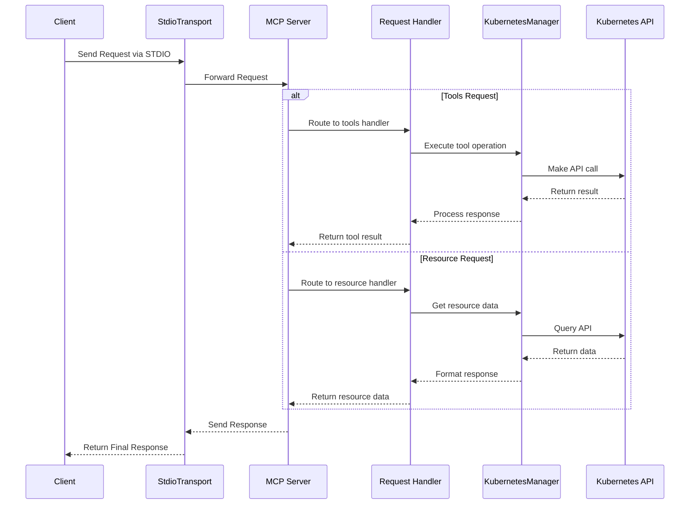

# mcp-server-kubernetes

MCP Server that can connect to a Kubernetes cluster and manage it.

https://github.com/user-attachments/assets/f25f8f4e-4d04-479b-9ae0-5dac452dd2ed

<a href="https://glama.ai/mcp/servers/w71ieamqrt"></a>

## Usage with Claude Desktop

```json
{
  "mcpServers": {
    "kubernetes": {
      "command": "npx",
      "args": ["mcp-server-kubernetes"]
    }
  }
}
```

The server will automatically connect to your current kubectl context. Make sure you have:

1. kubectl installed and in your PATH
2. A valid kubeconfig file with contexts configured
3. Access to a Kubernetes cluster configured for kubectl (e.g. minikube, Rancher Desktop, GKE, etc.)

You can verify your connection by asking Claude to list your pods or create a test deployment.

If you have errors, open up a standard terminal and run `kubectl get pods` to see if you can connect to your cluster without credentials issues.

## Features

- [x] Connect to a Kubernetes cluster
- [x] List all pods
- [x] List all services
- [x] List all deployments
- [x] Create a pod
- [x] Delete a pod
- [x] Describe a pod
- [x] List all namespaces
- [ ] Port forward to a pod
- [ ] Get logs from a pod for debugging
- [ ] Choose namespace for next commands (memory)
- [ ] Support Helm for installing charts

## In Progress

- [ ] [Docker support](https://github.com/Flux159/mcp-server-kubernetes/pull/9)

## Local Development

```bash
git clone https://github.com/Flux159/mcp-server-kubernetes.git
cd mcp-server-kubernetes
bun install
```

### Development Workflow

1. Start the server in development mode (watches for file changes):

```bash
bun run dev
```

2. Run unit tests:

```bash
bun run test
```

3. Build the project:

```bash
bun run build
```

4. Local Testing with [Inspector](https://github.com/modelcontextprotocol/inspector)

```bash
npx @modelcontextprotocol/inspector node build/index.js
# Follow further instructions on terminal for Inspector link
```

### Project Structure

```
src/
├── index.ts     # Main server implementation
├── types.ts     # TypeScript type definitions
└── unit.test.ts # Unit tests
```

### Contributing

1. Fork the repository
2. Create a feature branch
3. Make your changes
4. Add tests for new functionality
5. Ensure all tests pass
6. Submit a pull request

For bigger changes, please open an issue first to discuss the proposed changes.

## Architecture

This section describes the high-level architecture of the MCP Kubernetes server.

### Request Flow

The sequence diagram below illustrates how requests flow through the system:



## Not planned

Authentication / adding clusters to kubectx.
